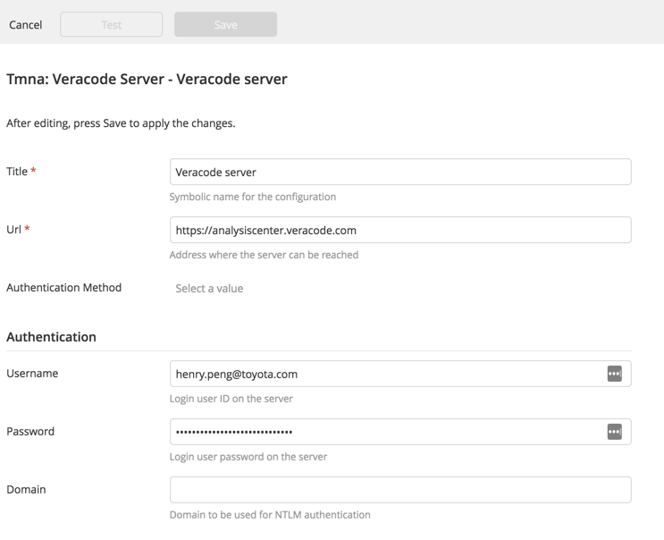
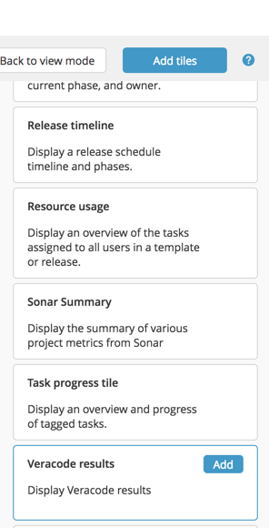
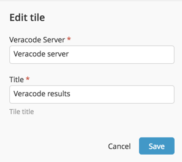
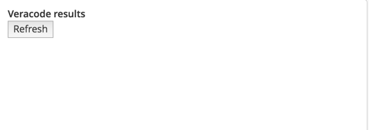
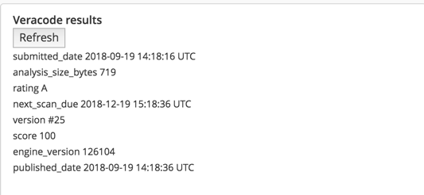
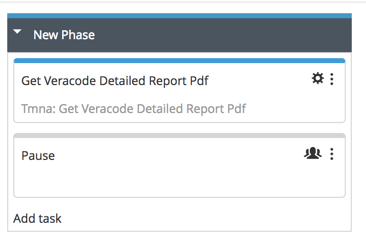
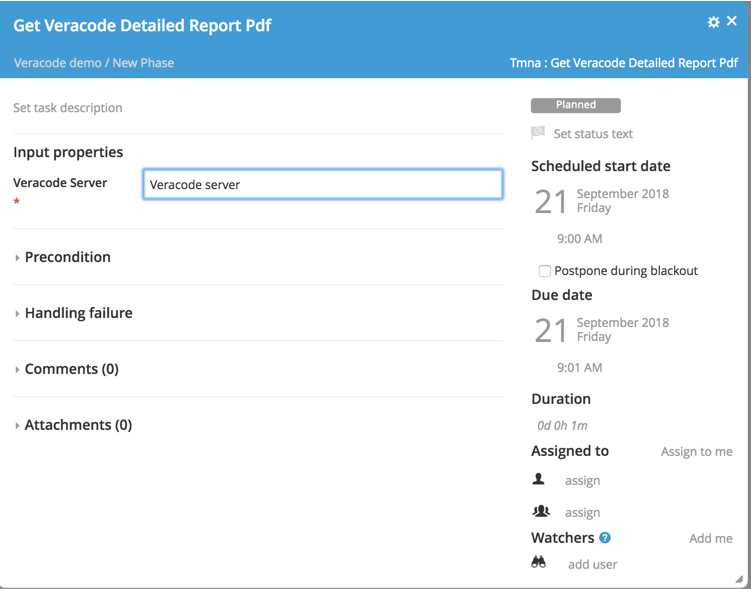
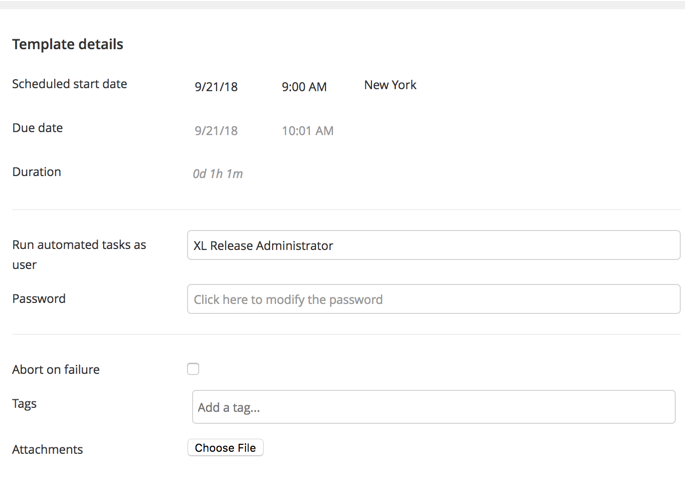
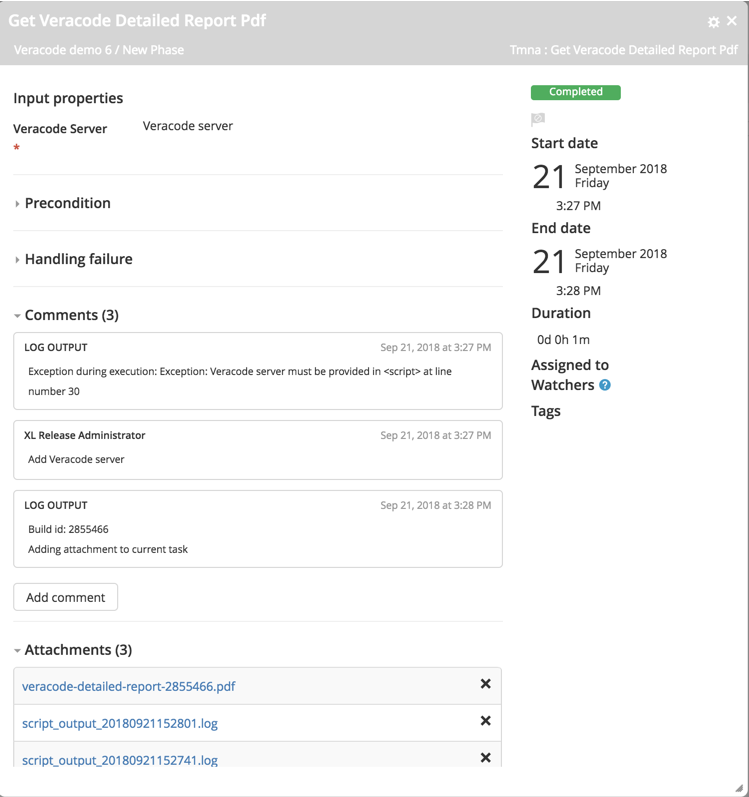

# TMNA XL Release Veracode plugin v1.0.0

## Preface

This document describes the functionality provided by the XL Release Veracode plugin.

See the [XL Release reference manual](https://docs.xebialabs.com/xl-release) for background information on XL Release and release automation concepts.  

## Overview

This plugin allows XL Release to pull code analysis data for a build from Veracode's API.

## Requirements

* XL Release 8.x

## Installation

* Run ./gradlew build from the repository root.
* Copy the jar file in build/libs to the xl-release-server/plugins/__local__ directory.
* Restart the XL Deploy|Release server.

## Features/Usage/Types/Tasks

### GetDetailedReportPdf task
Retrieves a PDF file from Veracode and attaches it to the task.

### VeracodeResultsTile
Displays data in a dashboard tile.

### Configuration:

* In Shared Configuration at the folder or global level, create a Tmna:Veracode Server with url, username, and password:
 

 
* In any template or release, go to the Release Dashboard and add a Veracode Results tile:
 

 
* Configure the tile with a title and a server from the configuration in step 2.
 

 
* Go back to view mode and confirm the tile is on the dashboard with a Refresh button visible:

 
 
* Press Refresh and wait a few seconds for the display to appear.  This is just a sampling of the data available in the output that Henry showed me.
 

 
* Add a Tmna:GetVeracodeDetailedReportPdf task to the template's Release Flow page:
 

 
* Configure the task with the Veracode server from the configuration in step 2.
 

 
* On the template or release properties panel, add user and password entries for "Run automated tasks as user".
 

* Run the release.  The pdf file will be pulled down from Veracode and affixed to the task as a downloadable attachment:

 
## References

<https://help.veracode.com/home>

